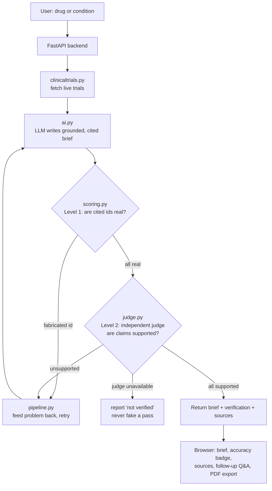

# Clinical Decision Brief

**Live demo:** https://cheiron-demo.onrender.com
_(Free tier — the first request after idle may take ~30–60s to wake the server.)_

An AI system that turns scattered biomedical evidence into **grounded, citation-verified** decision briefs. You enter a drug or condition; it pulls live trials from ClinicalTrials.gov, has an LLM write a concise brief, and then **independently verifies every citation** before showing it to you. You can ask follow-up questions that stay grounded in the same evidence, and export the whole session to PDF.

The guiding principle throughout: **in medicine, a confident-but-wrong answer is worse than no answer.** So the interesting engineering here isn't "make an LLM write a summary" — it's making the output *trustworthy*, and being *honest* when it can't be verified.

---

## What it does

- **Live evidence** — fetches current trials from ClinicalTrials.gov for any query.
- **Grounded brief** — an LLM writes a structured brief using *only* the retrieved trials, citing each claim with its NCT id.
- **Two-level verification**
  - **Level 1 (deterministic):** pure-Python check that every cited NCT id actually exists in the retrieved data — catches fabricated citations, instantly and for free.
  - **Level 2 (semantic):** an *independent, different-provider* model judges whether each cited trial actually supports its claim.
- **Self-correcting retry loop** — if either check fails, the system feeds the specific problem back to the model and asks it to fix it, up to a bounded number of retries.
- **Honest failure** — if verification can't run (e.g. the judge is rate-limited), the app says so rather than falsely claiming the brief passed.
- **Conversational follow-ups** — ask questions about the same evidence, with memory across turns, still grounded and cited.
- **PDF export** — download the brief, verification results, sources, and the full Q&A transcript.

---

## Architecture



Each module has a single responsibility and is independently testable:

| File | Responsibility |
|------|----------------|
| `clinicaltrials.py` | Fetch and clean trial data from ClinicalTrials.gov |
| `ai.py` | LLM calls: write the brief, answer follow-up questions |
| `scoring.py` | Level 1 — deterministic citation-validity check |
| `judge.py` | Level 2 — independent cross-provider claim-support judge |
| `pipeline.py` | The verify → retry state machine |
| `main.py` | FastAPI backend; wires the pieces together, serves the UI |
| `pdf_export.py` | Server-side PDF of the full session |
| `static/index.html` | Frontend (plain HTML + Tailwind), animated step tracker |

**Stateless backend:** the browser holds session state (trials + conversation) and sends it with each request. Simpler to reason about, and trivial to scale horizontally.

---

## Design decisions (and the roads not taken)

**Grounding over knowledge.** The model is never asked to answer from memory. Retrieved trials are placed directly in the prompt with strict instructions to use only that data and to admit gaps — a retrieval-augmented approach. This is what makes "no hallucination" a mechanism, not a hope.

**A deterministic check *and* a semantic one.** Level 1 is pure Python: it can't hallucinate, it's free, and it's instant — so it runs on every brief and catches the worst failure (invented citation ids). Level 2 needs a model because "does this source support this claim?" is a comprehension task. Using both means the cheap, certain check gates the expensive, nuanced one.

**A *different* provider as the judge.** Level 2 deliberately uses a model from a different provider than the one that wrote the brief, to avoid self-preference bias — a model grading its own work can be blind to its own failure patterns. Independence is the point.

**Level 2 on demand, not always-on.** The judge runs when requested rather than on every query. This was a direct response to hitting the judge's free-tier rate limit (below): semantic verification is costly, so it's spent where it matters instead of wasted on every request.

**Fail honestly.** Two decisions here. Early on, a network-fallback returned saved sample data — but that could surface *wrong-drug* results, so it was removed in favour of a clear error. Later, a bug was found where the app passed briefs as "verified" whenever the judge was simply unavailable; that was fixed so unavailability is reported, never hidden. A verification tool that silently skips verification is worse than one without it.

**Retry as correction, not reroll.** When a check fails, the model isn't just asked to try again — it's told *exactly* what failed ("you cited NCT… which isn't in the data" / "this claim wasn't supported"), so the retry is a targeted fix. The retry budget is bounded and shared across both checks, so the loop always terminates.

---

## Roadblocks (a partial field log)

Real build, real friction. A few that were instructive:

- **A whole domain returned `403` to Python but worked in the browser.** Methodically isolated it (browser vs. Python, one HTTP library vs. another, network vs. code) and found ClinicalTrials.gov was fingerprinting and rejecting one HTTP client specifically. Switched to Python's built-in `urllib`, which it accepts. *Lesson: when a request is refused, the client is often the problem, not you.*
- **The judge dropped connections intermittently.** Added retries with exponential backoff — standard practice for any real external API.
- **The judge's free tier hit a hard quota (429).** This reshaped the design: Level 1 always-on and free; Level 2 on-demand. A limitation turned into cost-aware architecture.
- **Environment gremlins.** A too-new Python release with immature package support, a virtual-env tool that hung on Windows, and a PATH that pointed the package manager at the wrong interpreter — each diagnosed and fixed rather than worked around blindly.

---

## Running it locally

```bash
python -m venv .venv
.venv\Scripts\Activate.ps1        # Windows;  source .venv/bin/activate on macOS/Linux
pip install -r requirements.txt
cp .env.example .env               # then add your API keys
uvicorn main:app --reload
```

Open http://127.0.0.1:8000.

Required environment variables (see `.env.example`):
- `ANTHROPIC_API_KEY` — for writing briefs and answering follow-ups
- `GEMINI_API_KEY` — for the independent Level 2 judge

## Running with Docker

```bash
docker build -t cheiron-demo .
docker run --rm -p 8000:8000 --env-file .env cheiron-demo
```

Secrets are passed at runtime (`--env-file`), never baked into the image.

---

## Honest limitations

- **Level 2 verifies against trial summaries**, not full study protocols — it confirms consistency with the retrieved data, not the entire study.
- **The judge is itself an LLM** — a strong, independent signal, but not ground truth.
- **Retrieval is a small, already-relevant set** rather than semantic search over millions of documents — the honest next step toward a real knowledge base.
- **Session state lives in the browser** — fine for a single-session tool; a persistent store would be the next step for history across sessions.

Knowing where the edges are is part of the design.
